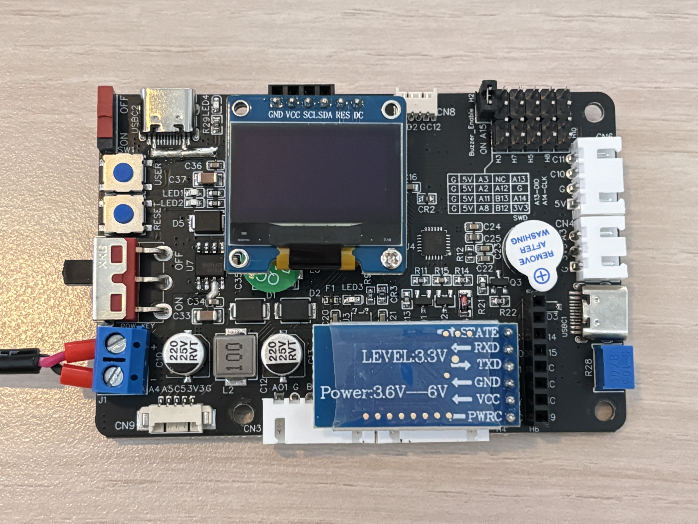

# Dual-Wheel-Balancing-Drone

## Introduction
This project is a two-wheeled self-balancing surveillance car based on Raspberry Pi and STM32, which refers to the design concept of the reconnaissance drone in the game "Rainbow Six Siege". We hope to realize a device that can move in complex environments and transmit images in real time, combining monitoring, pet interaction and entertainment functions.

The system supports web control, can transmit camera images to mobile phones or computers in real time, and has people detection function. The whole vehicle is composed of multiple modules, with a compact structure, equipped with a customized 3D printed shell, and a two-wheel balance structure to make the overall volume smaller. <strong>The overall shape is similar to a thermos cup, which can be easily picked up with one hand</strong>, suitable for daily movement or placement.

  

<em>Figure 1: Custom-designed 3D printed shell</em>

## Features
- **Real-time video transmission**: connect an external USB camera and view the image in real time on your phone or computer through the web page. Equipped with high-resolution cameras to ensure clear images and stable frame rates for real-time monitoring.
- **Webpage remote control**: Support webpage to control the movement of the car, including forward, backward and steering.
- **Personnel detection function**: after detecting a person, a signal is sent to STM32 via I2C. Applying deep learning algorithms for precise identification of family members, pets, and anomalies.

## Project Structure
This project consists of multiple functional modules, and the modules collaborate through serial ports, I2C or web page communications. The main modules are as follows:

### 1. Hardware control module (STM32)
This module is the underlying control core of the entire system, responsible for posture perception, self-balancing, OLED display, button response, and other functions.

  
 

<em>Figure 2: STM32 control board, connected to OLED display, buttons, Bluetooth module</em>

Specific features include:
- **Two-wheel self-balancing control**: Use the MPU6050 attitude sensor to obtain the angular velocity and acceleration data of the vehicle body in real time, combine the Kalman filtering algorithm to calculate the inclination angle, and adjust the left and right wheel speeds through the PID control algorithm to achieve self-balancing of the car when it is stationary or moving.
- **Status display and user interaction**:
  - Use OLED screen to display current system status (such as mode, connection status, etc.)
  - Support users to switch between different working modes or perform manual calibration by pressing buttons
  - This design also facilitates debugging and system testing during development, making it easier to monitor real-time status and locate potential issues
- **Other features**:
  - Control LED indicators to indicate the current operating status
  - Provides debugging interface (SWD) and Micro USB interface to facilitate program download and serial port output debugging information

The module is written in C++, with a clear overall structure and easy maintenance.

### 2. Motor drive module

This module focuses on controlling the rotation direction and speed of the left and right motors of the car, which directly affects the movement and posture adjustment of the vehicle.

 

 
<em>Figure 3: Raspberry Pi module</em>

We chose to put the motor control on the STM32 instead of relying entirely on the Raspberry Pi for the following reasons:
1. **Interface resource limitation**: The number of GPIOs of Raspberry Pi is limited, which makes it difficult to meet multiple functional requirements such as motor drive, sensor access, camera and communication at the same time.
2. **High demand for module expansion**: Our system also includes multiple peripherals such as OLED display, key input, LED indication, MPU6050 attitude sensor, etc. If all are connected to the Raspberry Pi, the wiring will be complicated and management will be difficult.
3. **Team development experience**: Team members are more familiar with the control logic of STM32, which facilitates the implementation of stable and reliable motion control and self-balancing algorithms.

Therefore, we adopted the architecture solution of **STM32 responsible for low-level control + Raspberry Pi responsible for image recognition and upper-level logic**, which not only reasonably utilized the performance advantages of each, but also facilitated division of labor and later debugging.

### 3. Video Transmission Module (Raspberry Pi)

- Video capture using an external USB camera

  

<em>Figure 4: USB external camera for video capture and image recognition</em>

- Real-time transmission of camera images to mobile phones or computers via web pages
- Build a lightweight web server to access images and send control signals

### 4. Image Recognition Module (People Detection)

- Use Raspberry Pi camera and libcamera tool for people detection
- After detecting a person, a control signal is sent to STM32 via I2C
- This module has its own documentation in the `PeopleDetection` folder

### 5. Web Interface

- Provides a web control interface, users can control the movement of the car through mobile phones or computers
- Control commands are sent to the Raspberry Pi, which then forwards them to the STM32 controller
- The page is simple and provides basic control buttons (such as forward, backward, turn left, turn right, etc.)

## Demo
...

## Follow Us

<em>
  We also share our project progress on Instagram. Follow us:
  <a href="https://www.instagram.com/realtime_project"><strong>Instagram @realtime_project</strong></a>
</em>

 
<em> 
  Feel free to connect with us and share your thoughts!
</em>

