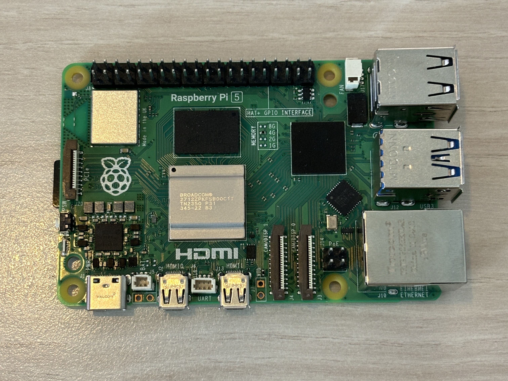
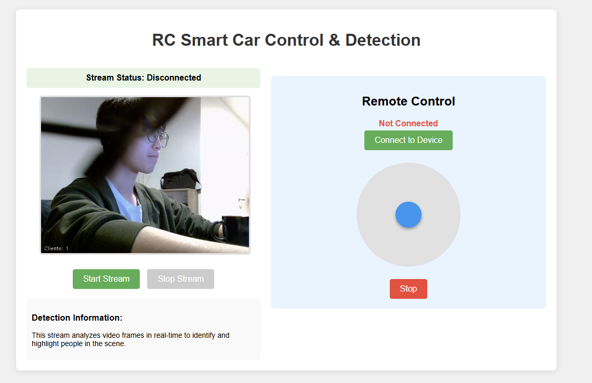

# Dual-Wheel Patrol Car

## Introduction
This project is a compact, self-balancing dual-wheel patrol car designed with real-time video transmission and remote control via web interface. Inspired by the reconnaissance drones from Rainbow Six Siege, the device combines surveillance, pet interaction, and entertainment functionalities.

Built primarily on **Raspberry Pi**, the system supports web-based control and live camera streaming to mobile or desktop devices. It integrates lightweight image recognition for people detection and supports responsive movement in real-world environments. The car is housed in a custom 3D-printed shell with a thermos-style cylindrical shape, making it easy to carry and store.

To better illustrate the overall structure and compact design, here is the finished prototype of the car:

  
 
<em>Figure 1: Final assembled car with compact dual-wheel design and thermos-shaped body</em>

## Key Features
- **Real-time video transmission**: USB camera with high-resolution output streamed through a web interface.
- **Webpage remote control**: Control movement (forward, backward, turning) via intuitive joystick-based interface.
- **Personnel detection**: Lightweight AI model for human presence detection with interaction response.

## Hardware Assembly
In order to achieve the goal of overall smallness and compact structure, we adopted a modular layered design and combined it with a 3D printed custom shell to complete the overall construction of the car.

- **Module Layout**

  The vehicle has a long and narrow shape:
  - The battery compartment is located centrally, with motors and wheels mounted on both sides.
  - Raspberry Pi is placed on the top for easy access and wiring.
  - A lightweight microcontroller unit (MCU) is also positioned nearby to assist with basic motor control and sensor data handling.
  - The camera is front-facing, mounted at the top center.
  - The shell uses a hollow structure to reduce weight while preserving rigidity.

- **Shell Design & Modeling**

  We used a vernier caliper to measure the size of the module, referred to the parameters on the official website, and performed parametric modeling in SolidWorks to facilitate size adjustment and symmetrical structure linkage. The overall shell is long and narrow, with functional modules arranged inside, with installation gaps reserved. The camera is installed in the front. The material is PLA, 3D printed by FDM, and finally assembled and debugged.

 
   
   
 

<em>Figure 2: Left: Rendering of the shell modeling | Right: Assembly diagram of the printed object</em>

💬 Note: In future iterations, PCB layout and shell structure can be further optimized to reduce both size and production cost.

## Project Structure
The system consists of multiple functional modules that communicate via I2C, serial ports, or web-based interfaces. The core architecture is built around Raspberry Pi, which manages the system’s logic, perception, communication, and user interface. A lightweight embedded module is included to assist with certain low-level tasks, such as motor signal handling and sensor reading.

### 1. Raspberry Pi Control Layer
The **Raspberry Pi** is the central controller of the entire system, responsible for:

- Running the **web server interface** and handling remote commands.
- Processing **camera images** for real-time video transmission and **people detection**.
- Sending control signals (movement, stabilization adjustments) to the embedded motor module via I2C.
- Coordinating all modules through centralized logic.

 

 
<em>Figure 3: Raspberry Pi module</em>

### 2. Motor Drive Module
This module handles the direction and speed of the car’s motors. Motor signals are triggered based on input from the Pi and adjusted dynamically based on feedback from the IMU.

The embedded module currently assists with driving the motors via PWM. However, all control decisions—including direction, mode switching, and higher-level path logic—are made on the **Raspberry Pi** side.

### 3. Embedded Support Module (Motor & Balance Assist)
This optional supporting module (based on a microcontroller) aids in handling motor PWM signals and reading sensor data for balance control.

#### Key functions:
- Reads data from the **MPU6050 IMU sensor**, including angular velocity and acceleration.
- Calculates orientation using a **Kalman filter**, and assists with real-time **stabilization** via a simple PID feedback loop.
- Controls indicators (e.g. LEDs, OLED) and allows manual input via buttons for basic interaction or debugging.

  
 

<em>Figure 4: Embedded controller board with OLED, buttons, and IMU connections</em>

### 4. Video Transmission Module
This module handles real-time image capture and streaming:

- An external **USB camera** is connected to the Raspberry Pi for high-resolution video input.
- A **lightweight web server** (hosted on the Pi) streams camera footage to mobile or desktop browsers over local network.
- The server also acts as the central hub for receiving and dispatching user control commands.

  

<em>Figure 5: USB external camera for video capture and image recognition</em>

### 5. Image Recognition Module (People Detection)
This module enables intelligent interaction through simple visual analysis:

- Runs on Raspberry Pi using the libcamera tool and a lightweight neural network for real-time **people detection**.
- Upon detection, the Pi triggers appropriate behavior such as initiating movement or sending control signals to the motor handler via I2C.
- This allows the vehicle to respond to human presence in basic interaction scenarios.

📂 Implementation details can be found in the `PeopleDetection` folder.

### 6. Web Interface
We have built a lightweight local web control interface on the Raspberry Pi, which users can access through mobile phones or computer browsers. It is easy to operate, has a simple and beautiful interface, and supports the following two core functions:

- **Real-time dashboard**
  The initial version used multiple buttons to achieve basic control (forward, backward, turn left, turn right, run, stop). After optimization, we upgraded it to a disc joystick controller, which improved the control smoothness and user experience, and supported more delicate direction and speed control.

- **Real-time video surveillance**
  The page displays the camera image in real time and supports face and person recognition functions, facilitating remote monitoring and interaction.

👉 A screenshot of the web interface is shown below :

  

<em>Figure 6: Screenshot of the web control interface</em>

## Demo Introduction
The demonstration video consists of four main parts:  
1. **Self-balancing** – The car automatically maintains balance even under external force disturbances.  
2. **Remote control** – Users can control movement (forward, backward, turning) in real time through the web interface.  
3. **Person following** – The car detects and follows a person ahead.  

👉 [Click here to watch the demo video on Instagram](https://www.instagram.com/reel/DIugJ1mI1mP/?igsh=MXB3c3hrdGwya2cwMg==)

## Follow Us

<em>
  We also share our project progress on Instagram. Follow us:
  <a href="https://www.instagram.com/realtime_project"><strong>Instagram @realtime_project</strong></a>
</em>

 
<em> 
  Feel free to connect with us and share your thoughts!
</em>

